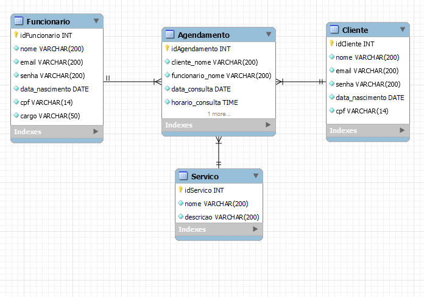

# Nome do Meu Projeto

Projeto Final do Curso Técnico Integrado de Desenvolvimento de Sistemas - Colégio Pedro II - Campus Duque de Caxias

**Integrantes:**
 - Pedro Henrique
 - Miguel
 - Caio
 - Rafael

 ## Descrição do Projeto

O projeto é um programa de uma clínica de agendamento médico 

O programa tem como objetivo agendar clientes para um atendimento médico com profissionais da própria clínica

## Documentação

- [Manual do Usuário](manual.md)
- [Requisitos](requisitos.md)
- [Casos de Uso](casos-de-uso.md)
- [Apresentação](apresentacao.pdf)

**Diagrama de Classes**

**Modelagem do Banco de Dados**

